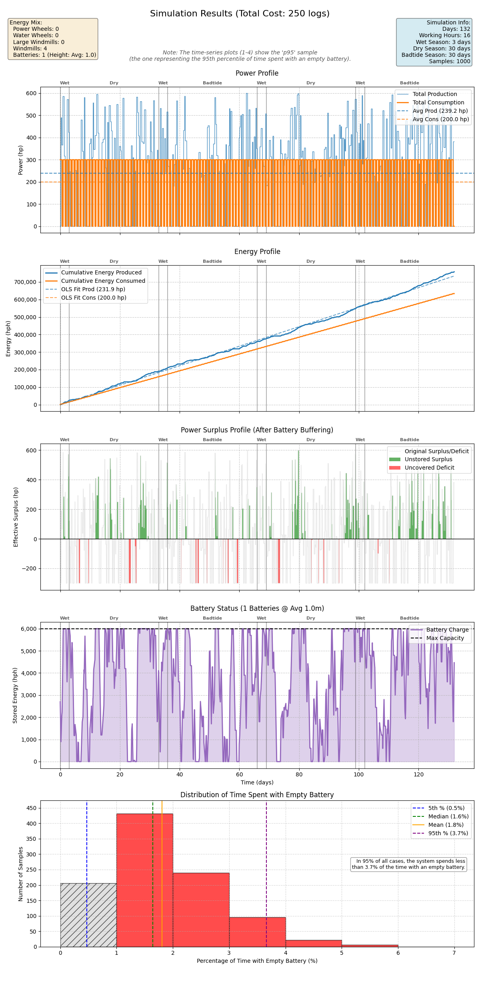

# Timberborn Vibed Power Mix

A simulation and optimization tool for power management in Timberborn. This tool helps you determine the optimal mix of power sources and batteries to sustain your factories through wet, dry, and badtide seasons.



## Installation

Ensure you have Python 3.13+ installed. This project uses [Poetry](https://python-poetry.org/) for dependency management.

```bash
poetry install
```

## Usage

The tool provides a CLI with two main commands: `simulate` and `optimize`.

### Simulate

Simulate a specific configuration of power producers, consumers, and batteries. This will generate a plot showing power generation, consumption, and battery levels over time.

```bash
poetry run tb-power-mix simulate \
    --large-windmills 5 \
    --windmills 2 \
    --battery-heights 10,10,10 \
    --lumber-mills 2 \
    --gear-workshops 1
```

### Optimize

Find the most efficient power mix for a given set of factories. The optimizer uses the **NSGA-II (Non-dominated Sorting Genetic Algorithm II)** to balance building costs against power reliability.

```bash
poetry run tb-power-mix optimize \
    --lumber-mills 5 \
    --steel-factories 2
```

The optimizer searches for a **Pareto Frontier** of solutions that minimize both material cost and battery stress, eventually selecting the configuration that hits a target reliability of ~95%.

**Key Parameters:**
- `--[factory-name] [count]`: Specify the factories you need to power.
- `--days [count]`: Duration of the simulation cycle.

## Data Insights

The simulation accounts for:
- **Intermittent Production**: Power generation fluctuates due to wind strength, seasonal water flow changes, and working hours.
- **Seasons**:
  - **Wet Season**: Water wheels function normally.
  - **Dry Season**: Water wheels stop working.
  - **Badtide**: Water wheels continue to function (assuming contaminated water still flows).
- **Working Hours**: Factories only consume power during specified working hours (default: 16h/day).
- **Battery Physics**: Gravity battery capacity scales with height.
- **Battery Stress Index**: A non-linear metric that penalizes configurations that frequently run low on power, used to guide the optimizer toward stable grids.

### Visualizing Performance
The generated plots help you understand the dynamics of your power grid:
- **Sufficiency & Timing**: Verify if you produce enough power and, crucially, if you produce it *at the right time* relative to your working hours.
- **Battery Reaction**: Observe how your battery system reacts to the generation of power over time, smoothing out intermittent production.
- **Surplus & Deficits**: Check if your setup correctly captures energy surplus during high-production windows and if it has enough depth to cover deficits.
